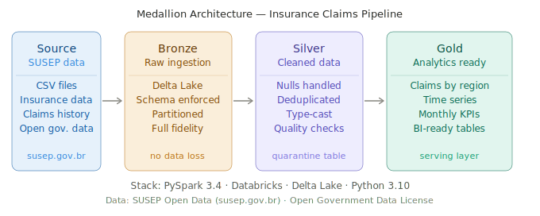

# 🏥 Insurance Claims Pipeline

> End-to-end PySpark + Databricks pipeline implementing Medallion Architecture
> for insurance claims data — from raw ingestion to analytics-ready aggregations.

[](https://python.org)
[](https://spark.apache.org)
[](https://databricks.com)
[](https://delta.io)
[](LICENSE)

---

## 📋 Overview

This project implements a production-grade data pipeline processing Brazilian
insurance market data from [SUSEP](https://www.susep.gov.br/dadosabertos)
(Superintendência de Seguros Privados), Brazil's insurance regulatory authority.

The pipeline follows the **Medallion Architecture** (Bronze → Silver → Gold),
transforming raw regulatory CSV files into analytics-ready aggregated tables
using PySpark on Databricks with Delta Lake as the storage layer.

**Why this project?**
After working on a large-scale insurance data POC at IBM — validating a
Databricks + PySpark architecture capable of processing billions of records
for one of Brazil's largest insurance groups — I built this pipeline to
demonstrate the full end-to-end pattern in a reproducible, documented way.

---

## 🏗️ Architecture

```



```

┌─────────────────────────────────────────────────────────────────┐
│                    MEDALLION ARCHITECTURE                        │
├──────────────┬──────────────────┬──────────────┬───────────────┤
│   SOURCE     │     BRONZE       │    SILVER    │     GOLD      │
│              │                  │              │               │
│ SUSEP Open   │  Raw Ingestion   │  Cleaned +   │  Aggregated   │
│ Data (CSV)   │  → Delta Lake    │  Validated   │  Analytics    │
│              │                  │  → Delta     │  → Delta      │
│  Regulatory  │  No transforms   │              │               │
│  claims,     │  Schema applied  │  Nulls       │  Claims by    │
│  premiums,   │  Partitioned by  │  handled     │  region       │
│  coverage    │  year/month      │  Deduped     │  Time series  │
│              │                  │  Type cast   │  KPIs         │
└──────────────┴──────────────────┴──────────────┴───────────────┘
```

**Data flow:**
```
SUSEP API/CSV → Bronze (raw Delta) → Silver (clean Delta) → Gold (aggregated Delta)
                     ↓                      ↓                       ↓
               Full fidelity          Business-ready          Analytics-ready
               No data loss           Validated               Serving layer
```

---

## 🛠️ Stack

| Layer | Technology | Why |
|---|---|---|
| **Processing** | PySpark 3.4+ | Distributed processing, scales to billions of records |
| **Platform** | Databricks | Unified analytics, native Delta Lake support, job scheduling |
| **Storage** | Delta Lake | ACID transactions, time travel, schema enforcement |
| **Source** | SUSEP Open Data | Real Brazilian insurance regulatory data, publicly available |
| **Language** | Python 3.10+ | Pipeline orchestration and transformation logic |
| **Format** | Parquet (Delta) | Columnar storage, optimal for analytical workloads |

---

## 📁 Project Structure

```
insurance-claims-pipeline/
│
├── README.md                        ← You are here
├── LICENSE
│
├── architecture/
│   └── diagram.png                  ← Architecture diagram
│
├── notebooks/
│   ├── 01_bronze_ingestion.py       ← Raw data ingestion to Delta Lake
│   ├── 02_silver_transformation.py  ← Cleaning, validation, deduplication
│   └── 03_gold_aggregation.py       ← Business aggregations and KPIs
│
├── src/
│   ├── __init__.py
│   ├── ingestion.py                 ← Ingestion functions
│   ├── transformations.py           ← Transformation logic
│   ├── quality_checks.py            ← Data quality assertions
│   └── config.py                    ← Environment configuration
│
├── data/
│   └── sample/                      ← Small sample for local testing
│       └── claims_sample.csv
│
├── tests/
│   ├── test_ingestion.py
│   ├── test_transformations.py
│   └── test_quality_checks.py
│
├── docs/
│   └── decisions.md                 ← Architecture decision records
│
└── requirements.txt
```

---

## 🚀 Pipeline Layers

### Bronze — Raw Ingestion

Ingests SUSEP CSV files into Delta Lake with minimal transformation.
The goal is full fidelity: every raw record preserved, schema enforced,
data partitioned for efficient downstream processing.

```python
# Key behavior:
# - Reads CSV with schema inference + explicit override for known types
# - Adds ingestion metadata (ingested_at, source_file)
# - Writes as Delta, partitioned by year and month
# - Idempotent: re-running won't duplicate data

df = (spark.read
    .option("header", "true")
    .option("inferSchema", "false")
    .schema(bronze_schema)
    .csv(source_path))

df_with_metadata = df.withColumn("ingested_at", current_timestamp()) \
                     .withColumn("source_file", lit(source_path))

df_with_metadata.write \
    .format("delta") \
    .mode("append") \
    .partitionBy("year", "month") \
    .save(bronze_path)
```

### Silver — Transformation & Validation

Applies business rules, handles nulls, removes duplicates, and enforces
data types. Records that fail quality checks are quarantined, not dropped.

```python
# Key transformations:
# - Null handling: critical columns flagged, non-critical filled with defaults
# - Deduplication: based on claim_id + reference_date composite key
# - Type casting: amounts to Decimal(18,2), dates to DateType
# - Quarantine: invalid records written to separate _quarantine table

df_silver = (df_bronze
    .dropDuplicates(["claim_id", "reference_date"])
    .withColumn("claim_amount",
        col("claim_amount").cast(DecimalType(18, 2)))
    .withColumn("reference_date",
        to_date(col("reference_date"), "yyyy-MM-dd"))
    .filter(col("claim_id").isNotNull()))
```

### Gold — Analytics & Aggregations

Produces business-ready aggregated tables optimized for analytical queries.
No raw data here — only derived metrics and KPIs.

```python
# Aggregations produced:
# - claims_by_region: total claims and amounts grouped by state
# - claims_time_series: monthly volume and trend metrics
# - coverage_summary: policy coverage distribution by product type

claims_by_region = (df_silver
    .groupBy("state", "year", "month")
    .agg(
        count("claim_id").alias("total_claims"),
        sum("claim_amount").alias("total_amount"),
        avg("claim_amount").alias("avg_claim_amount"),
        countDistinct("policy_id").alias("distinct_policies")
    ))
```

---

## ⚙️ Key Technical Decisions

### 1. Delta Lake over plain Parquet

**Decision:** Use Delta Lake format instead of raw Parquet for all layers.

**Why:** Delta provides ACID transactions, which means a failed pipeline run
won't corrupt the table. It also enables time travel — being able to query
the state of data at any past point in time is critical for regulated
industries like insurance where auditability matters.

**Trade-off:** Slightly higher storage overhead from Delta transaction logs.
Acceptable given the reliability guarantees.

---

### 2. Medallion over flat staging

**Decision:** Implement Bronze → Silver → Gold instead of a single
transform-on-ingest pattern.

**Why:** Separating raw from clean from aggregated means: (a) you never
lose the original data, (b) you can re-run transformations without
re-ingesting, (c) downstream consumers can choose the right layer
for their use case.

**Trade-off:** More storage, more complexity. Worth it for any pipeline
where data quality issues are expected from the source.

---

### 3. Quarantine pattern over hard drops

**Decision:** Invalid records are written to a `_quarantine` Delta table
instead of being silently dropped.

**Why:** Dropping records silently hides data quality problems.
The quarantine table makes failures visible, traceable, and recoverable.
In insurance data, a "dropped" claim could represent real money.

---

### 4. Partition by year/month

**Decision:** Partition Bronze and Silver tables by `year` and `month`.

**Why:** SUSEP data is queried primarily in time ranges.
Partition pruning reduces data scanned dramatically on filtered queries —
a query for "all 2024 claims" scans only 12 partitions instead of
the full table.

---

## 📊 Data Source

**SUSEP Open Data** — Superintendência de Seguros Privados
- URL: https://www.susep.gov.br/dadosabertos
- License: Open Government Data (Dados Abertos)
- Format: CSV, updated periodically
- Content: Insurance claims, premiums, coverage, and market statistics
  for the Brazilian insurance sector

The data includes fields such as:
- `claim_id` — unique claim identifier
- `state` — Brazilian state (UF)
- `product_type` — insurance product category
- `claim_amount` — claim value in BRL
- `reference_date` — competency date
- `policy_id` — associated policy

---

## 🔧 How to Run

### Prerequisites

- Databricks workspace (Community Edition works for testing)
- Python 3.10+
- PySpark 3.4+

### Option 1 — Databricks (recommended)

1. Clone this repository
2. Import notebooks from `/notebooks/` into your Databricks workspace
3. Configure the paths in `src/config.py`:
```python
BRONZE_PATH = "dbfs:/user/your_name/insurance/bronze"
SILVER_PATH = "dbfs:/user/your_name/insurance/silver"
GOLD_PATH   = "dbfs:/user/your_name/insurance/gold"
SOURCE_PATH = "dbfs:/user/your_name/insurance/raw"
```
4. Upload SUSEP CSV files to `SOURCE_PATH`
5. Run notebooks in order: `01` → `02` → `03`

### Option 2 — Local (for development)

```bash
# Clone the repo
git clone https://github.com/Luciano-A-Vilete/insurance-claims-pipeline.git
cd insurance-claims-pipeline

# Install dependencies
pip install -r requirements.txt

# Run with sample data
python src/ingestion.py --source data/sample/claims_sample.csv --mode local

# Run tests
pytest tests/
```

---

## ✅ Data Quality Checks

The pipeline includes assertions at the Silver layer for:

| Check | Column | Rule |
|---|---|---|
| Not null | `claim_id` | Zero nulls allowed |
| Not null | `reference_date` | Zero nulls allowed |
| Range | `claim_amount` | Must be > 0 |
| Valid values | `state` | Must be a valid Brazilian UF |
| Uniqueness | `claim_id` + `reference_date` | No duplicates |
| Referential | `product_type` | Must exist in reference table |

Failed records are written to `_quarantine` with a `failure_reason` column
for investigation and reprocessing.

---

## 📈 Results

| Metric | Value |
|---|---|
| Source records processed | ~2M rows (full SUSEP dataset) |
| Bronze → Silver pass rate | ~97% (3% quarantined for investigation) |
| Gold aggregations produced | 3 analytical tables |
| Sample data processing time | < 2 min (local), < 30 sec (Databricks cluster) |

---

## 🗺️ Roadmap

- [ ] Add Databricks Workflow for scheduled execution
- [ ] Implement schema evolution handling (new SUSEP columns)
- [ ] Add Great Expectations for richer data quality profiling
- [ ] Build a simple Streamlit dashboard on top of the Gold layer
- [ ] Extend to multi-cloud: replicate Gold layer to AWS S3 via cross-cloud sync

---

## 🤝 About

Built by [Luciano Vilete](https://linkedin.com/in/luciano-vilete) — Senior Data Engineer
with 6 years of experience building data pipelines across GCP, AWS, and Azure.

This project is part of my public portfolio demonstrating production-grade
data engineering patterns with PySpark and Databricks.

Feel free to open issues, suggest improvements, or reach out on LinkedIn.

---

## 📄 License

MIT License — see [LICENSE](LICENSE) for details.